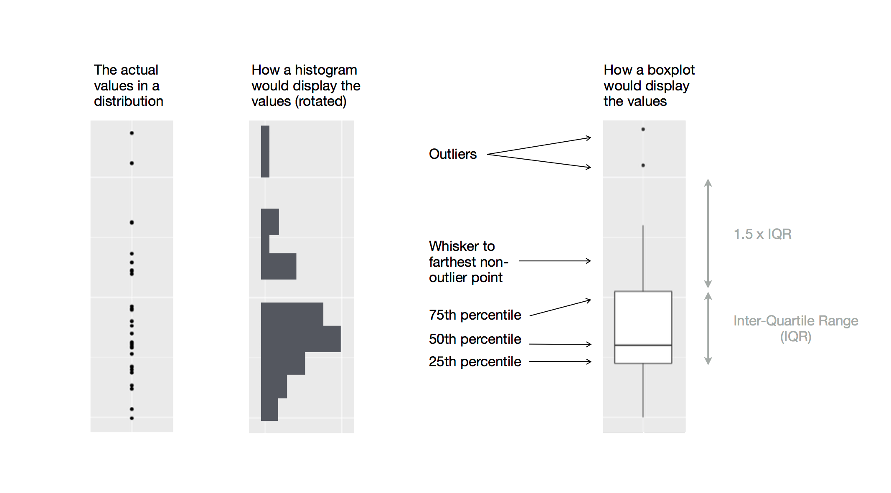
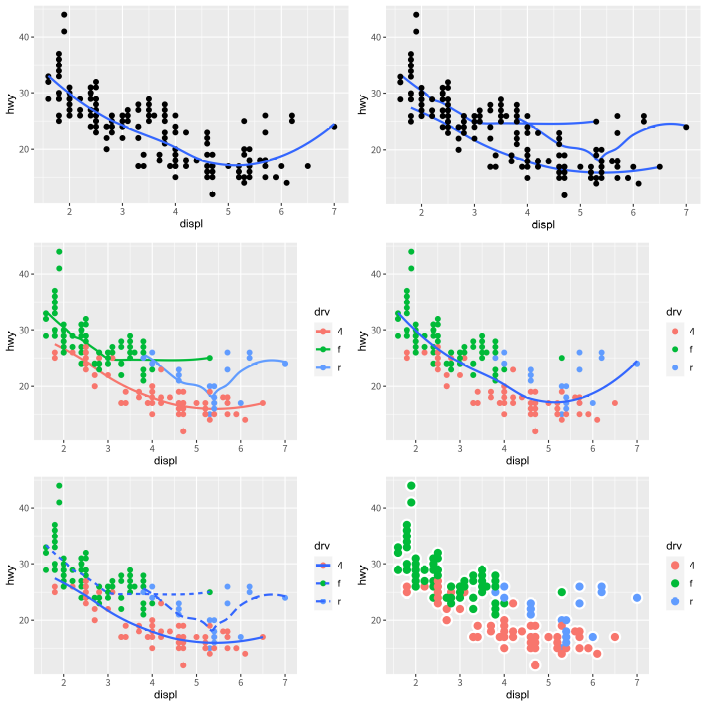

前回はイントロダクションということで、何ができるようになるか、について紹介する内容でした。今回は実践に入ります。可視化をする場面はいろいろだと思いますが、思ったとおりの実験データが取れているか、変な数値が出てるところはないか、初めてやる実験のときには、変数間にどんな傾向があるのか、が知りたいために可視化することが多いと思います。そんなとき「〇〇をはっきりさせたい」という目的や仮説、主張がもちろんあると思うのですが、どんな風に可視化すればその主張を最も良く表現できるか、というのが問題になります。そのためには、そもそもどういう可視化方法があるのか知っていることが前提になる、ということで...。

<big>
今回の話題:  

* 様々な種類の geom を知る  
* 図を見やすくする  

</big>

geom とは、という説明をしても抽象的になるので、まずはやってみましょう。  

# geom を知る  

## ライブラリのロード  

まずは、可視化用ライブラリをロードします。  

```{r results = 'hide'}
library(tidyverse)
```

## 使うデータ  

今回は自作データと、tidyverse に含まれるデータを使います。  

* x: 時系列データの例（この後自作します）
* diamonds: ダイヤモンドのデータ（tidyverse に含まれる）
* mpg: 車の燃費のデータ（tidyverse に含まれる）

復習として、データを表示してみましょう。

```{r echo = TRUE}
diamonds   # Ctrl + Enter で実行
```

```{r echo = TRUE}
mpg   # Ctrl + Enter で実行
```

## geom の基本  

まずは説明に使うデータを自作します。

```{r}
# データの用意　　　　　　　　　　 # Ctrl + Shift + Enter で実行
time <- 1:100                      # 時間 1秒から100秒まで1秒刻みで作成
x <- rnorm(100, mean = 0, sd = 5)  # 正規分布にしたがう乱数を発生
df <- tibble(time , x)             # time と x を データフレーム df に
df                                 # df の確認
```

```{r}
# データの描画
ggplot(df, aes(time, x)) +
  geom_point(size = 2)
```

これは tidyverse パッケージに含まれる、ggplot2 というパッケージの機能を使っています。ggplot2 は次のような考え方でグラフを描画します。  

<big>
【ggplot2 による描画 - 階層グラフィックス文法】   

* ggplot() コマンドで、これから ggplot2 によるグラフ描画を始めることを宣言。  
* geom_point で、実際にグラフを描く。  
* geom を続けて実行すると、後に実行した geom（グラフ）が一番手前側に重ねられる。   
</big>

上の例では、geom が1回しか実行されてないので、次に1つ増やしてみます。geom_line により、ポイントの間をラインで結ぶことができます。  

```{r}
ggplot(df, aes(time, x)) +
  geom_point(size = 2) + 
  geom_line()
```

これだけだと、何が階層グラフィックス文法なのかわからないので、geom_line でラインの色を変えてみます。  

```{r}
ggplot(df, aes(time, x)) +
  geom_point(size = 2) + 
  geom_line(col = "red")
```

各ポイントをよく見ると、ポイントマーカーの手前側にラインが表示されていて、ポイントが見づらくなってるのがわかると思います。これは、geom_point の後に geom_line で描画したためです。そこで逆にしてみましょう。  

```{r}
ggplot(df, aes(time, x)) +
  geom_line(col = "red") +    　# geom_line を先に実行
  geom_point(size = 2)
```

こうすると、ラインが先に、その後にポイントが描画されるので、ラインがポイントの後ろに来ます。この部分は、Excelは自動でやってくれる（というか順序入れ替えできない？）ので、面倒に思う部分だと思います。が、ラインとポイントの色を異なる色にすることはあんまりないと思うので、今みなさんが感じるほど面倒と思うことはあまりありません。  
ここで言いたいことは、とにかく  

<big>
後に実行したものが手前に来る
</big>

ということで理解してもらえれば十分です。  

## いろいろな geom  

ここから先はいろいろな geom を紹介します。いっぱいあって全部は紹介しませんが、よく使うものや便利なものを中心に紹介します。ただ読むだけではつまらないと思うので、後ろの方に練習問題を用意しましたのでお楽しみに。  

### geom に共通の設定

イントロダクション含めて何度も出てきている geom_point を例に、どの geom でも共通の設定をここでまとめます。基本的なコマンドの実行方法は次のとおり。  

```{r}
# 基本
ggplot(data = mpg, aes(x = displ, y = hwy, col = class)) +  # displ：排気量, hwy：高速道路での燃費（マイル/ガロン） 
  geom_point()
```

ggplot() + geom_〇〇　というのが基本形です。

ggplot()の中での設定：  

* data: これから描画するデータを指定（データフレーム）  
* aes: エステティック属性を指定。ここでは x軸、y軸の指定＋色分けにどの変数を用いるか指定。変数は data で指定したデータフレームの変数のみ指定可能。  

データフレームにどんな変数名の変数が含まれるかは、以下のコマンドで確認可能です。  

```{r}
# データフレームに含まれるデータの変数名の確認方法①
str(mpg)
```

この出力の一番左の列に注目してください。manufacturer 〜 class まで、11 個の変数が含まれているのがわかります。今後データフレームの作り方は説明しますが、自分で作ったデータフレームでも、変数名を忘れることがあるので、このコマンドが便利です。  

ところで、次の方法でも確認は可能です。

```{r echo = TRUE}
# データフレームに含まれるデータの変数名の確認方法②
mpg
```

今後は一番上の行に着目してください。manufacturer から右に向かって変数が並んでいますのでそこから確認することもできますが、列数が多いと画面に入り切らないのでスクロールが必要です。  

どっちか好きな方でやってみてください。  

------------------------------------------------------------------------------------------
ちょっと戻って、aes()の中で指定する項目について、今回は散布図の色分けを class という変数に応じて行っています。このように、データフレームのある変数の水準にしたがって色分けすると傾向がつかみやすくなって便利です。他の変数に変更して試してみてください。  

ちなみに他のやり方で区別することも可能です。よく使うのは、

* size: マーカーのサイズを水準に応じて変える  
* alpha: マーカーの透明度を水準に応じて変える  
* shape: マーカーの形を水準に応じて変える  

これらはイントロダクションでも紹介しましたので、例は省略します。  

また、aes() は geom の中で実行することも可能です。    

```{r}
# geom の中で　aes() を指定する
ggplot(data = mpg) +  # displ：排気量, hwy：高速道路での燃費（マイル/ガロン） 
  geom_point(aes(x = displ, y = hwy, col = class))
```

さきほどと同じ図が出力されます。これは、ggplot(aes())の場合は、その後に実行する geom すべてに適用されるのに対して、geom_point(aes())などとした場合は、**その geom の中だけで aes() の設定が有効**、という違いがあります。今回は　geom が1つだけなので、両者は同じになりました。geom を複数実行する場合は、geom　ごとに色の付け方などを変えられるようになっている、ということになります。  

ちなみにすべてのマーカーを同じ色にしたい、というような場合は、（geom の中で）col を aes()の外に出して実行します（注：ggplot(aes(), col = "red") では実行できません）。  

```{r}
# マーカーの色をすべて同じ色に変える
ggplot(data = mpg) +  # displ：排気量, hwy：高速道路での燃費（マイル/ガロン） 
  geom_point(aes(x = displ, y = hwy), col = "red")  # col を aes() の外に出す
```

最後に、"data =" や、"x =" という部分は省略可能です。慣れてきたら次のようにしましょう。  

```{r}
# data = や x = を省略
ggplot(mpg) +  # displ：排気量, hwy：高速道路での燃費（マイル/ガロン） 
  geom_point(aes(displ, hwy, col = class))  
```

ただし、col や　size などは省略できませんので注意してください。  

### geom_point, geom_jitter - 散布図  

何度も出てきているのでもう飽きたかもしれませんが、まだ紹介してない機能があるのです。 
直前にプロットした、displ - hwy の図を見てください。displ は離散的な数値しか取らない変数であることがわかります。それでプロットしているので、ポイントが重複しているかもしれません。こんなときは、次の引数を設定すると便利です。  

```{r}
ggplot(mpg) + 
  geom_point(aes(displ, hwy, col = class), position = "jitter")  # position = jitter 追加
```

何か点が増えた気がします。position = jitter を 指定すると、本来の値から少しだけずらしてプロットして重複しないようにしてくれます。ずらす量はデフォルトでいい感じに計算してくれますが、明示的に指定することも可能です。その場合は、geom_point の代わりに geom_jitter を使います。

```{r}
# geom_jitter
ggplot(mpg) + 
  geom_jitter(aes(displ, hwy, col = class), width = 1)
```

## geom_line, geom_smooth - ライン

ラインを描くのはもうやりました。異なる系列でラインの色を分けるときなどは col を活用しましょう。  
ここではデータに適合する曲線を描く方法を紹介します。  

```{r}
# データに適合する直線を描く
ggplot(mpg, aes(displ, hwy)) +
  geom_point() +
  geom_smooth(method = "lm")  # 線形回帰
```

上の図はすべての点（class などごとではなく）を近似する直線を描いています。青い曲線の上下に幅のあるグレー帯は適合の誤差範囲で、推定したパラメータ（ここでは、切片と勾配）の95％信頼区間を表しており、se 引数でオンオフ切り替えられます（注：データのばらつき範囲ではありません）。method を変えると他の方法で描くことも可能です。  

```{r}
# データに適合する曲線を描く
ggplot(mpg, aes(displ, hwy)) +
  geom_point() +
  geom_smooth(method = "loess")  # loess による適合
```

col を指定することで、変数の水準ごとに曲線を適合させることも可能です。  

```{r}
# データに適合する曲線を描く
ggplot(mpg, aes(displ, hwy, col = drv)) +
  geom_point() +
  geom_smooth(method = "loess")  # loess による適合
```

ちなみに色分けしないで良いときは group により指定します。  

```{r}
# データに適合する曲線を描く
ggplot(mpg, aes(displ, hwy, group = drv)) +   # col → group に変更
  geom_point() +
  geom_smooth(method = "loess")  # loess による適合
```


## geom_boxplot - 箱ひげ図  

散布図でも似たようなことはできますが、分布の要約も含めて可視化できるのが geom_boxplot です。  

```{r}
# 箱ひげ図
ggplot(mpg, aes(class, hwy)) +
         geom_boxplot()
```

上と下にひげ生えていて、真ん中に箱がある図が並んでますが、こういうものです。箱の下端、上端はそのデータ群の25％、75％分位点を表しています。分位点というのはデータを小さい順に下から並べたとき、25％点なら 下から数えて25％の順位のところ、75％点なら下から数えて75％の順位のところの値のことです。50％点はちょうど真ん中にくる値なので、中央値（median）と呼ばれます。例えば 2seater では、下から数えて 25％の順位に来るのが hwy = 24 くらい、75％のところに来るのが hwy = 26 くらいです。つまり、hwy = 24〜26 の間に、全データの 50％が含まれていることになります。この範囲を四分位範囲（Inter Quatile Range）と呼びます。その他の説明は次の図を参照してください。outliersは外れ値で、明らかに値が外れたもの明示しています。



↑Shift + Clickで拡大図になります。  

<https://r4ds.had.co.nz/exploratory-data-analysis.html> より抜粋。 

横軸のそれぞれの水準で、着目する変数がどんな分布をしているか分かりやすいですね。例えば、pickup と suv は他と比べて明らかに燃費が悪いようだ- など。    

箱ひげ図は横軸に離散変数、縦軸に連続変数を取ることに注意してください。離散変数とはその名の通り離散的な値しか取らない変数のことですが、文字列やファクタのことです（詳細後日）。↑の例は、class変数が文字列型になっています。2seaterとか、compact とかは文字列型、と呼ばれます。一方、ファクタ型は一見して数値ですがレベルを表すだけでその差には意味がない変数のことを指します。例えば、アンケートの評点です。1,2,3,4,5 段階で評価した点数は、水準を表すだけで、差に意味はありません（意味あるのもあるかもしれませんが）。どのデータが何型なのかは、変数名を確認するときに使った str() で確認することができます（文字列型："chr"、ファクター："factor"）。  

なお、geom_boxplotの場合は、色の割当が col ではなく fill になります。  

```{r}
# 箱ひげ図：色分け
ggplot(mpg, aes(class, hwy, fill = class)) +
         geom_boxplot()
```

## geom_bar - 棒グラフ  

棒グラフの方がデータを比較しやすいこともありますが、デフォルトの設定ではカウントデータを表示することに注意してください。  

```{r}
# 棒グラフ
ggplot(diamonds) +
  geom_bar(aes(cut))
```

↑の図は、横軸に cut（離散変数）ですが、縦軸はコマンドでは何も指定していません。この場合、縦軸はカウントデータになります。つまり、cut が Ideal のものは 20,000個以上、cut が Premium のものは 14,000個くらいのデータが含まれていることが分かります。このデータセットは Ideal, Premium, Very Good がほとんどで、Good や Fair は割合が少ないことが分かります。　　

実用的にはカウントデータではなく、異なる水準のデータを比較したいことが多いと思います。こういう場合は、stat = "identity" を追加します。ここでは、diamonds の cut ごとの平均価格を比較したいと思いますが、それを導くコードは後日説明しますので、流してください。  

```{r}
# cut ごとの diamonds の平均価格 - 後日説明
price.mean <- diamonds %>%
  group_by(cut) %>%          # cut でデータをグループ化
  summarize(                 # 要約量を出力する関数
    price = mean(price)      # mean: 平均値を出力
  )

# 棒グラフ
ggplot(price.mean, aes(fill = cut)) +          # geom_bar も fill で色分けする
  geom_bar(aes(cut, price), stat = "identity")
```

## 練習問題 

### 問題1：geom_pointとgeom_smooth



↑Shift + Clickで拡大図になります。  

### 問題2：geom_boxplot  

データセット：diamonds について、以下の問題にトライしてみましょう。  

1) diamonds に含まれる変数はどんなものが含まれるか。  
2) そのうち、離散変数は何か。
3) いずれかの離散変数に対して、price の箱ひげ図を描く。  


